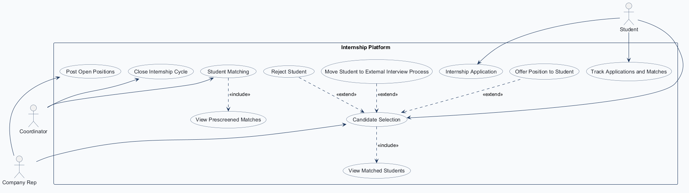
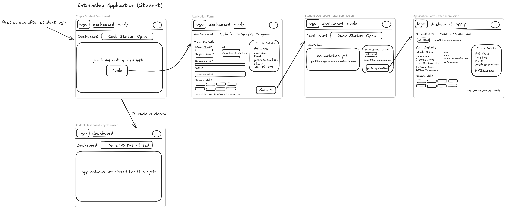
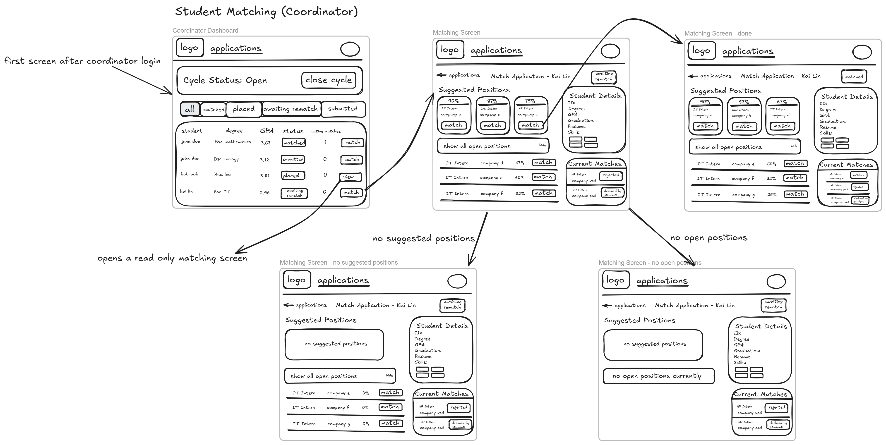
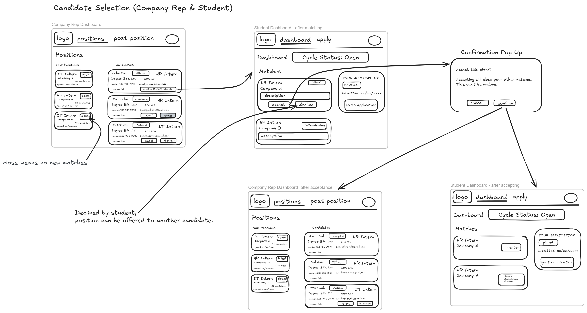
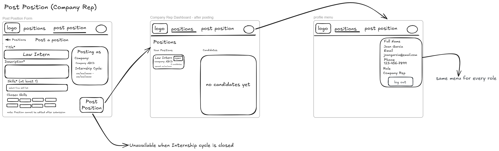
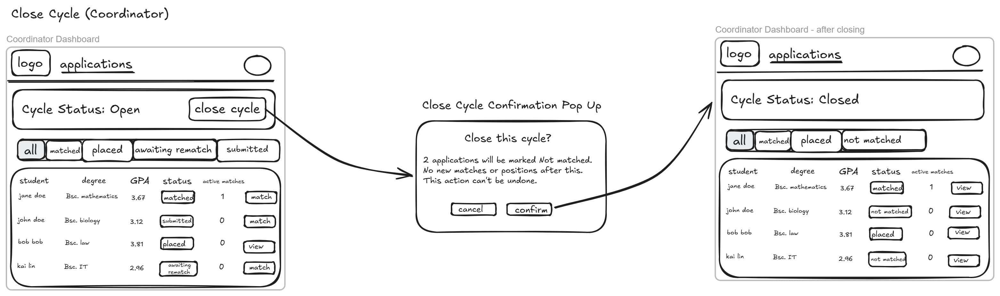

# COMP 3613 Assignment 1

Draft this file with the Guide. **Update it after every phase milestone** before you pause. The use-case diagram is a UML PNG at `docs/diagrams/use-case.png`, linked from this file as `diagrams/use-case.png` (path relative to `docs/report.md`). The model diagram is Mermaid. **Embed wireframe images** as `wireframes/<file>` (files live in `docs/wireframes/`).

Do not put your student ID in this file if you will commit it. The PDF cover adds your name and ID at export time.

## Assigned project

Internship Platform

## Three workflows

### 1.

Internship application (student)

### 2.

Student matching (coordinator)

### 3.

Candidate selection (company rep)

## Use case diagram

Phase 2 decisions: Students apply to the general internship program, not to a specific position. Student Matching includes viewing prescreened suggestions when the coordinator opens the matching screen; suggestions are limited to open positions and students not yet placed at a company, and a declined position is not suggested to that student again. The coordinator makes final position matches within Student Matching. Students can track their applications and matches; the coordinator can close the internship cycle; Company Reps can post open positions. Candidate Selection includes viewing matched students and is shared by the Company Rep and Student: the student's acceptance or decline completes the use case. Offering a position, moving a student to an external interview process, and rejecting a student are extensions of Candidate Selection. Student Matching occurs before Candidate Selection, but they remain independent use cases with no include/extend relationship between them.

## Model diagram

Phase 3 draft, revised in Phase 5 as the workflow decisions were refined.

Assumptions: the internship program runs only at the UWI St. Augustine campus and is open to students across all faculties; resumes are stored as a link rather than an uploaded file. Positions belong to the company and are tied to an internship cycle, so closing a cycle can close the related positions. The `Match` record remains separate from `Application` to track interviews, offers, and outcome states without losing the original application record.

Phase 5 model revision: a company may temporarily have no company representative, but may have at most one. `CompanyRep.companyID` is unique, and the ERD now shows the optional one-to-one relationship.

Phase 4 model review: the matching wireframe displays a fit percentage for suggested positions. This score will be calculated when suggestions are shown rather than stored on `Match`; no new model field is needed.

Phase 5 model revisions requested by the student:

- Remove `Coordinator`; coordinator identity is represented by `User.role`, so a separate coordinator table duplicates account information.
- `Student.studentID` is entered as the student's UWI ID and is the primary key; it is not auto-generated. Reject duplicate UWI IDs with a friendly message.
- Add a unique constraint on `Application(studentID, cycleID)` to enforce one application per student per cycle.
- Add a unique constraint on `Match(applicationID, positionID)` to prevent duplicate matches for the same application and position.
- Do not suggest or match a position again for a student after that student's previous match for the position was declined or rejected. Because this history can span applications, matching services must check prior match outcomes in addition to the per-application database uniqueness constraint.

Internship Application decisions: students without an application see the empty dashboard and can apply. The student profile is created when the application is submitted; account details entered at registration supply the read-only profile details shown on the form. The student enters their UWI ID, which becomes `Student.studentID`. Once an application exists, hide the dashboard Apply action and show a route to the read-only application view. Check for an existing application before submission and enforce the student/cycle unique constraint in the database as a final guard; if a duplicate reaches that guard, redirect to the read-only application with a friendly “You have already applied for this cycle” message. A duplicate UWI ID is also rejected with a friendly message. The workflow uses the single internship cycle shown in the wireframe.

## Wireframes

The five wireframes cover all use cases in the Phase 2 diagram. Profile details and skills, application and cycle states, position details, and match outcomes shown in the designs are represented by the existing model fields. Match-fit percentages are calculated when suggestions are shown rather than persisted. Position candidate counts and active-match counts are display values derived from related records.

### Internship Application

### Student Matching

### Candidate Selection

### Post Open Positions

### Close Internship Cycle

<!-- student-build:wireframe-coverage
use_case: Internship Application
image: docs/wireframes/internship_application.png
covered: yes
-->

<!-- student-build:wireframe-coverage
use_case: Student Matching
image: docs/wireframes/student_matching.png
covered: yes
-->

<!-- student-build:wireframe-coverage
use_case: View Prescreened Matches
image: docs/wireframes/student_matching.png
covered: yes
-->

<!-- student-build:wireframe-coverage
use_case: Track Applications and Matches
image: docs/wireframes/candidate_selection.png
covered: yes
-->

<!-- student-build:wireframe-coverage
use_case: Close Internship Cycle
image: docs/wireframes/close_cycle.png
covered: yes
-->

<!-- student-build:wireframe-coverage
use_case: Post Open Positions
image: docs/wireframes/post_position.png
covered: yes
-->

<!-- student-build:wireframe-coverage
use_case: Candidate Selection
image: docs/wireframes/candidate_selection.png
covered: yes
-->

<!-- student-build:wireframe-coverage
use_case: View Matched Students
image: docs/wireframes/candidate_selection.png
covered: yes
-->

<!-- student-build:wireframe-coverage
use_case: Offer Position to Student
image: docs/wireframes/candidate_selection.png
covered: yes
-->

<!-- student-build:wireframe-coverage
use_case: Move Student to External Interview Process
image: docs/wireframes/candidate_selection.png
covered: yes
-->

<!-- student-build:wireframe-coverage
use_case: Reject Student
image: docs/wireframes/candidate_selection.png
covered: yes
-->

`python manage.py report` also embeds any PNG/JPG still missing from `docs/wireframes/`.

## Theming

InternBridge uses a modern, professional visual identity. The main color is dark teal (`#172D36`), with mint (`#C3E8CF`) for filled accents, dark green for links, warm off-white (`#F8F6EE`) page backgrounds, white (`#FFFFFF`) cards, muted grey (`#566A6F`) for small text, and warm neutral (`#E9E2D2`) borders. Manrope is loaded from Google Fonts. The light logo is used on the landing, login, and registration pages; the primary logo is used in the authenticated dark-teal navigation, and the InternBridge favicon is set site-wide. Logos appear without background boxes. The landing page identifies employers as company reps and places “Students: Create an Account” before the larger single Sign in button in the header. The headline is arranged as “Your Field.”, “Your Future.”, and “Connected.” on three consecutive lines without changing its text size. Its slightly reduced right-side bridge illustration connects a Jane Doe applicant card to IslandGrid's Software Engineering Intern card, with a thinner dark-teal semicircular arch, straight legs that stop at the deck, and a deck line matching the logo. The mint dot follows the legs and arch from the student card to the company card. A “Matched by coordinator” label sits above the arch, with a check badge at the arch apex and a raised “Offer accepted” chip. The four-second animation plays once and settles into its completed state; the illustration is shifted slightly right on desktop. The browser title is InternBridge; the landing page presents the tagline “Your Field. Your Future. Connected.”

The landing, login, and registration pages and authenticated navigation now use these brand styles. The signed-in navigation follows the wireframe's horizontal logo / Dashboard / Apply / profile layout. The placeholder FastStarter landing copy and demo-login footer have been removed; authentication and `/config` remain available.

Status badges follow the InternBridge palette: `Submitted`, `Matched`, `Interviewing`, `Awaiting Rematch`, and `Open` are light teal; `Offered` and `Awaiting Student Response` are amber; `Accepted`, `Placed`, and `Filled` are mint/green; `Rejected by Company`, `Declined by Student`, and `Not Matched` are soft red; closed statuses are grey. The shared status formatter normalizes spaces, hyphens, and underscores, and the student verified the colors on the relevant pages.

## Implementation notes

Phase 5 is complete. All three named workflows—Internship Application, Student Matching, and Candidate Selection—and both supporting workflows—Post Open Positions and Close Internship Cycle—are implemented, student-verified, and polished against the agreed designs.

### Internship Application (complete and verified)

Students with no existing application see the empty dashboard and can apply. Their `Student` row is created with the application; full name, email, and phone come from the account created at registration and are read-only on the application form. Existing applications open in a read-only view. The service prechecks for duplicates; the database constraint is the final guard, and a conflict returns the student to the read-only view with a friendly message. The coordinator table has been removed in favor of the role on `User`. The student/cycle constraint is implemented in the application model; Match uniqueness and declined/rejected-position exclusion are recorded above for the Student Matching workflow.

Student-reported verification: invalid GPA and resume links were rejected; valid submissions succeeded. Reapplication attempts made in different ways were handled correctly, duplicate UWI IDs were rejected, and applications without selected skills were rejected. The student verified the themed 401 page, enlarged cycle status, removable single-click skill chips, and enlarged application-status badge. The student confirmed Workflow 1 is good.

### Student Matching (complete and verified)

Corrected student decision: the suggested-position fit percentage is the count of the student's skills that overlap the position's required skills, divided by the total number of required skills for that position. Calculate it whenever the coordinator opens the matching screen; do not persist the percentage. It is coordinator-only. Sort equal-percentage positions alphabetically by position title, then company name, with ascending numerical position ID as the fallback.

When the coordinator clicks Match, create a `Match` row with status `matched`; change the application's status to `matched` only if it is not already. Keep the position open until a student accepts an offer. Do not show a confirmation popup; remove the position from Suggested Positions and show it under Current Matches. Do not allow matching when the cycle is closed, the application is placed, the position is not open, or that application/position pair already has a match. A position declined or rejected for that student is not suggested or matched to them again.

The matching view follows the wireframe's coordinator dashboard and matching-screen states, including student details, current matches and their outcomes, the Suggested Positions list, the expandable all-open-positions list, and the empty states for no suggestions or no open positions.

Implementation: fit is computed on each matching-screen request. The screen presents up to three highest-ranked positive-fit suggestions and keeps the remaining open positions in the expandable list; existing matches are shown separately. Matching creates the unique `Match` record, updates the application to `matched` when needed, and leaves the position open.

Student-reported verification: the student tested Workflow 2 against its wireframe, reported the missing visible application-status badge and that active-match counts should include `matched`, `interviewing`, and `offered` matches, and then re-verified the fixes. The student confirmed the workflow works as expected and confirmed the status-color palette shown in the Theming section.

The student reports that all work for Workflows 1 and 2 is complete, verified, and follows the corresponding wireframes.

### Candidate Selection (complete and verified)

Candidate Selection is shared by the Company Rep and Student, following `docs/wireframes/candidate_selection.png`. Company reps can view candidates only for positions owned by their company. Rep actions are Reject, Interview, and Offer; student actions are Accept or Decline an offer, with an explicit confirmation before acceptance because it cannot be undone.

An accepted offer changes the selected Match to `accepted`, marks its Position `filled`, changes the student's Application to `placed`, closes that student's other matches as `closed - student placed elsewhere`, and closes other candidates' matches for the filled position as `closed - position filled`. A declined match is `declined by student`; a rejected match is `rejected by company`. A declined position remains available to other candidates, while a filled position does not. Only one candidate may have a pending offer for a position.

An active match has status `matched`, `interviewing`, or `offered`. When a decline, company rejection, or another candidate's acceptance closing a match leaves the student's application with no active matches, set the application to `awaiting rematch` if the cycle is open and `not matched` if the cycle is closed. `awaiting rematch` returns to the coordinator's matching queue only while the cycle is open. Closing the cycle prevents new matches but does not block Company Rep or student actions on existing matches.

Implementation: the Company Rep dashboard shows each rep's own positions and their candidates, with Interview, Offer, and Reject actions enabled for valid states. Students see all matches for their application on the dashboard; an offered match can be declined directly or accepted after confirming in the irreversible-action modal. Acceptance marks the position filled and application placed, and closes active competing matches. Rejection, decline, and match closure apply the no-active-match queue/status rule. The requested `NotACompanyRepError`, `MatchIDNotFoundError`, `MatchNotInCompanyError`, `InvalidActionError`, and `OfferAlreadyPendingError` are raised by the service. Existing-match actions remain available after cycle closure.

Student-reported verification: company scoping, status-specific buttons, interview and offer transitions, independent offers at different companies, the acceptance confirmation, closing other matches, position-filled state, and coordinator dashboard statuses and counts all work. The Company Rep view groups candidates under each position, differing from the wireframe; the student prefers this clearer layout and asked to retain it. Polish added close controls and five-second auto-dismiss behavior to flash messages across their display surfaces, and disables other candidates' Offer buttons while a position already has a pending offer. The student rechecked and confirmed the refinements; Workflow 3 is complete and verified.

### Post Open Positions (supporting workflow; complete and verified)

The Company Rep posts positions for the company linked to their account. The form follows `docs/wireframes/post_position.png`: required title and description, at least one skill selected from the existing skill list, and a read-only posting-as panel showing the company and active internship-cycle dates. A successful post returns to the Company Rep Positions dashboard. Submitted positions cannot be edited. Posting is unavailable when the internship cycle is closed; the Post Position navigation link remains visible but disabled with an explanation.

The existing `Position` and `PositionSkill` entities represent postings and their required skills. A posted position belongs to the authenticated rep's company and the open cycle, opens with status `open`, and records the posting date. No new database entity is needed.

Implementation: added the `post_position_view` page at `/rep/positions/new` and a thin POST handler. The form uses the existing skill picker/chip behavior and displays the authenticated rep's company and open cycle dates. `PositionPostingService` validates the authenticated company rep, open cycle, trimmed non-empty title and description, and a non-empty set of existing, unique skills. It raises `InvalidTitleInputError`, `InvalidDescriptionInputError`, and `InvalidSkillInputError`; the route reuses `NotACompanyRepError` and `CycleClosedError`. The repository saves the Position and PositionSkill rows in one transaction. The dashboard's Post Position link is disabled with a closed-cycle explanation when unavailable.

Student-reported verification: the posting company and cycle details are correct; blank and whitespace-only titles/descriptions and no-skill submissions are rejected; valid postings succeed, appear under the correct Company Rep with zero candidates, and are available in the coordinator's suggested positions. The initial valid post failure was caused by a mismatch between the posting field name (`skill_ids`) and the shared skill-picker's `skillIDs`; the form and route now use `skillIDs` consistently.

The student also requested the wireframe's read-only profile dropdown with name, email, phone, role, and Log out, available across authenticated screens and roles; it replaces the former inline Logout link while keeping the inline name. The Log out action has a dark-teal fill and white text. Student-reported verification: the profile menu works as expected across roles, and the disabled Post Position link was verified during Close Internship Cycle testing.

### Close Internship Cycle (supporting workflow; complete and verified)

The coordinator confirms closure in an irreversible confirmation modal. On closure, open positions in the cycle become `closed`; positions already `filled` stay filled. Existing matches remain actionable and may still resolve; a closed position may become filled when an existing match is accepted. No new positions or matches may be created after the cycle is closed.

The confirmation counts only applications whose status is `submitted` or `awaiting rematch` and which have no active matches. Those applications become `not matched` on confirmation. Placed applications are unchanged and excluded. Applications with status `matched` and at least one active match remain `matched` and excluded; if their final active match ends after cycle closure, the existing cycle-aware transition changes the application to `not matched`.

Student-reported verification: Cancel leaves the cycle open; the modal count is correct; open positions close while filled positions remain filled; application statuses update as specified; Post Position is disabled with an explanation; existing offers can still be accepted after closure and the closed position becomes filled; a post-closure rejection changes a student with no remaining active matches to not matched; and new students see applications closed. The Close cycle trigger uses a filled soft-red style per student feedback.

Implementation: the coordinator dashboard previews the eligible application count and submits a thin route after the irreversible confirmation. `InternshipCycle.status` defaults to `open`. `CycleClosureService` coordinates the transition; `CycleClosureRepository` queries and persists the cycle, its open positions, and eligible applications atomically. The legacy admin-only branch in `admin_home_view` was removed at the student's request.

Polish: after closure, the coordinator dashboard shows only All, Matched, Placed, and Not Matched filters, as in the wireframe. `MatchingService` selects this closed-cycle filter set and rejects filter values outside it. The student verified the filters and results; this supporting workflow is complete and verified.

<!-- student-build:code-check
workflow: Close Internship Cycle
form: choice
layer: other
architecture_ok: yes
implement_confidence: 0.84
passed: yes
note: Chose to close open positions while preserving filled positions and allowing existing matches to continue to resolution.
-->

<!-- student-build:code-check
workflow: Close Internship Cycle
form: choice
layer: other
architecture_ok: yes
implement_confidence: 0.86
passed: yes
note: Defined the closure count and application transitions for submitted, awaiting-rematch, matched-with-active-matches, and placed applications.
-->

<!-- student-build:code-check
workflow: Close Internship Cycle
form: snippet
layer: model
architecture_ok: yes
implement_confidence: 0.84
passed: yes
note: Set InternshipCycle.status to default to open for new cycle instances.
-->

<!-- student-build:code-check
workflow: Close Internship Cycle
form: snippet
layer: router
architecture_ok: yes
implement_confidence: 0.86
passed: yes
note: Thin coordinator route delegates closure to CycleClosureService, handles domain errors with feedback and redirects, and contains no database operations.
-->

<!-- student-build:code-check
workflow: Post Open Positions
form: snippet
layer: model
architecture_ok: yes
implement_confidence: 0.84
passed: yes
note: Added non-empty minimum-length model validation to the required Position title and description fields.
-->

<!-- student-build:code-check
workflow: Post Open Positions
form: snippet
layer: router
architecture_ok: yes
implement_confidence: 0.86
passed: yes
note: Thin posting handler delegates title, description, and selected skill IDs to PositionPostingService, maps domain errors, and redirects without persistence logic.
-->

<!-- student-build:code-check
workflow: Post Open Positions
form: choice
layer: other
architecture_ok: yes
implement_confidence: 0.86
passed: yes
note: Chose to keep Post Position visible but disabled with an explanation when the cycle is closed.
-->

<!-- student-build:code-check
workflow: Candidate Selection
form: open
layer: other
architecture_ok: yes
implement_confidence: 0.82
passed: yes
note: Defined active-match statuses and no-active-match application transitions for declines, rejections, and position-filled closures.
-->

<!-- student-build:code-check
workflow: Candidate Selection
form: mcq
layer: service
architecture_ok: yes
implement_confidence: 0.82
passed: yes
note: Correctly chose Service to coordinate offer acceptance and its related match/position/application transitions.
-->

<!-- student-build:code-check
workflow: Candidate Selection
form: choice
layer: other
architecture_ok: yes
implement_confidence: 0.82
passed: yes
note: Restricted Company Rep candidate visibility and actions to positions belonging to the rep's company.
-->

<!-- student-build:code-check
workflow: Candidate Selection
form: choice
layer: other
architecture_ok: yes
implement_confidence: 0.82
passed: yes
note: Confirmed a candidate whose only active match closes because another student fills the position follows the same cycle-aware application status rule.
-->

<!-- student-build:code-check
workflow: Candidate Selection
form: snippet
layer: model
architecture_ok: yes
implement_confidence: 0.84
passed: yes
note: Set the new Match status default to matched, consistent with the matching workflow's initial state.
-->

<!-- student-build:code-check
workflow: Candidate Selection
form: snippet
layer: router
architecture_ok: yes
implement_confidence: 0.86
passed: yes
note: Thin Company Rep action route delegates to CandidateSelectionService, maps domain errors, and redirects without persistence logic.
-->

<!-- student-build:code-check
workflow: Internship Application
form: choice
layer: other
architecture_ok: yes
implement_confidence: 0.65
passed: yes
note: Specified hidden Apply, existing-application precheck, database uniqueness, and duplicate redirect/message.
-->

<!-- student-build:code-check
workflow: Internship Application
form: open
layer: model
architecture_ok: yes
implement_confidence: 0.70
passed: yes
note: Student record is created on first application; account details supply read-only profile information.
-->

<!-- student-build:code-check
workflow: Internship Application
form: mcq
layer: service
architecture_ok: yes
implement_confidence: 0.80
passed: yes
note: Correctly selected Service to decide whether a repeat submission may proceed.
-->

<!-- student-build:code-check
workflow: Internship Application
form: snippet
layer: model
architecture_ok: yes
implement_confidence: 0.82
passed: yes
note: Added a named composite unique constraint on Application(studentID, cycleID); student clarified UWI ID is manually entered and the Student primary key.
-->

<!-- student-build:code-check
workflow: Internship Application
form: snippet
layer: router
architecture_ok: yes
implement_confidence: 0.84
passed: yes
note: Route constructs repository/service, passes form data, and maps domain errors to redirects without persistence code.
-->

<!-- student-build:code-check
workflow: Student Matching
form: mcq
layer: service
architecture_ok: yes
implement_confidence: 0.82
passed: yes
note: Correctly chose Service to coordinate the on-demand scoring and ordering of suggested positions.
-->

<!-- student-build:code-check
workflow: Student Matching
form: choice
layer: other
architecture_ok: yes
implement_confidence: 0.82
passed: yes
note: Defined match creation, application status transition, position availability, no-confirmation behavior, and invalid matching conditions.
-->

<!-- student-build:code-check
workflow: Student Matching
form: snippet
layer: model
architecture_ok: yes
implement_confidence: 0.84
passed: yes
note: Added a named unique constraint on Match(applicationID, positionID) and clarified that a company has at most one rep but may have none temporarily.
-->

<!-- student-build:code-check
workflow: Student Matching
form: snippet
layer: router
architecture_ok: yes
implement_confidence: 0.86
passed: yes
note: Thin POST handler calls MatchingService, maps domain errors to feedback, and redirects successful matches to matching_view.
-->

## Deployed app

Phase 6. Public Render URL (not localhost). Markers open this to mark the three workflows.

https://

## Logins

The following synthetic marker accounts are loaded by `seed-sample` when the Render service starts. Shared password: `Internbridge2026`.

| Username | Role |
|---|---|
| `coordinator.demo` | Coordinator |
| `rep.bluepeak` | Company Rep |
| `rep.islandgrid` | Company Rep |
| `rep.seabright` | Company Rep |
| `rep.peoplefirst` | Company Rep |
| `rep.coralledger` | Company Rep |
| `student.jane` | Student |
| `student.jordan` | Student |
| `student.amara` | Student |
| `student.malik` | Student |
| `student.casey` | Student |
| `student.renee` | Student |

## YouTube URL

## Session transcripts

Filled when the Guide builds the report: the agent writes each Guide chat to `docs/transcripts/<slug>.md` (Copilot Agent, Cursor, or OpenCode). `python manage.py report` packages them. Do not paste chats here during the build.

## Competency (student-judge)

Filled when the report is built. Guide runs student-judge, writes `docs/judge.md`, and export appends the scorecard here.

## Skill integrity

Filled by `python manage.py report`. Do not edit the course skills.
