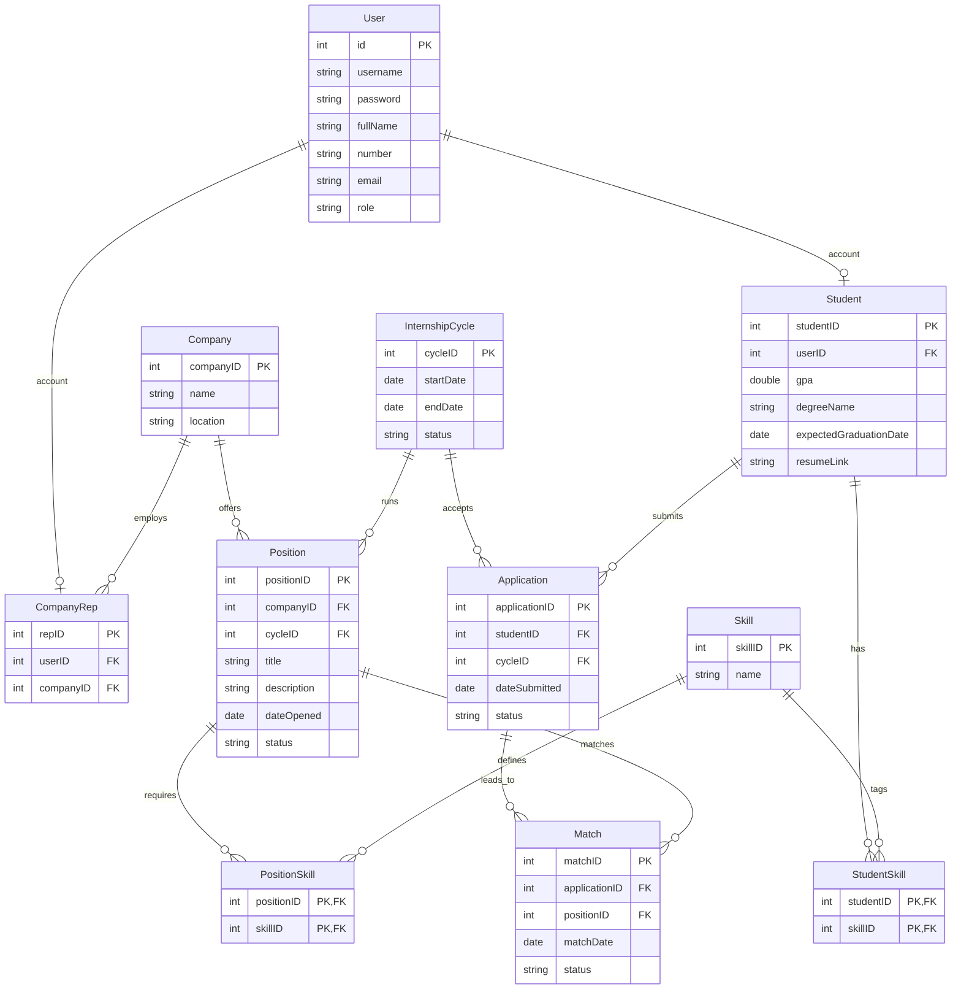

# COMP 3613 Assignment 1

Draft this file with the Guide. **Update it after every phase milestone** before you pause. The use-case diagram is a UML PNG at `docs/diagrams/use-case.png`, linked from this file as `diagrams/use-case.png` (path relative to `docs/report.md`). The model diagram is Mermaid. **Embed wireframe images** as `wireframes/<file>` (files live in `docs/wireframes/`).

Do not put your student ID in this file if you will commit it. The PDF cover adds your name and ID at export time.

## Assigned project

Internship Platform

## Three workflows

### 1.

Internship application (student)

### 2.

Student matching (coordinator)

### 3.

Candidate selection (company rep)

## Use case diagram

Phase 2 decisions: Students apply to the general internship program, not to a specific position. Student Matching includes viewing prescreened suggestions when the coordinator opens the matching screen; suggestions are limited to open positions and students not yet placed at a company, and a declined position is not suggested to that student again. The coordinator makes final position matches within Student Matching. Students can track their applications and matches; the coordinator can close the internship cycle; Company Reps can post open positions. Candidate Selection includes viewing matched students and is shared by the Company Rep and Student: the student's acceptance or decline completes the use case. Offering a position, moving a student to an external interview process, and rejecting a student are extensions of Candidate Selection. Student Matching occurs before Candidate Selection, but they remain independent use cases with no include/extend relationship between them.

## Model diagram

Phase 3 draft, revised in Phase 5 as the workflow decisions were refined.

Assumptions: the internship program runs only at the UWI St. Augustine campus and is open to students across all faculties; resumes are stored as a link rather than an uploaded file. Positions belong to the company and are tied to an internship cycle, so closing a cycle can close the related positions. The `Match` record remains separate from `Application` to track interviews, offers, and outcome states without losing the original application record.

Phase 4 model review: the matching wireframe displays a fit percentage for suggested positions. This score will be calculated when suggestions are shown rather than stored on `Match`; no new model field is needed.

Phase 5 model revisions requested by the student:

- Remove `Coordinator`; coordinator identity is represented by `User.role`, so a separate coordinator table duplicates account information.
- `Student.studentID` is entered as the student's UWI ID and is the primary key; it is not auto-generated. Reject duplicate UWI IDs with a friendly message.
- Add a unique constraint on `Application(studentID, cycleID)` to enforce one application per student per cycle.
- Add a unique constraint on `Match(applicationID, positionID)` to prevent duplicate matches for the same application and position.
- Do not suggest or match a position again for a student after that student's previous match for the position was declined or rejected. Because this history can span applications, matching services must check prior match outcomes in addition to the per-application database uniqueness constraint.

Internship Application decisions: students without an application see the empty dashboard and can apply. The student profile is created when the application is submitted; account details entered at registration supply the read-only profile details shown on the form. The student enters their UWI ID, which becomes `Student.studentID`. Once an application exists, hide the dashboard Apply action and show a route to the read-only application view. Check for an existing application before submission and enforce the student/cycle unique constraint in the database as a final guard; if a duplicate reaches that guard, redirect to the read-only application with a friendly “You have already applied for this cycle” message. A duplicate UWI ID is also rejected with a friendly message. The workflow uses the single internship cycle shown in the wireframe.

## Wireframes

The five wireframes cover all use cases in the Phase 2 diagram. Profile details and skills, application and cycle states, position details, and match outcomes shown in the designs are represented by the existing model fields. Match-fit percentages are calculated when suggestions are shown rather than persisted. Position candidate counts and active-match counts are display values derived from related records.

### Internship Application

### Student Matching

### Candidate Selection

### Post Open Positions

### Close Internship Cycle

<!-- student-build:wireframe-coverage
use_case: Internship Application
image: docs/wireframes/internship_application.png
covered: yes
-->

<!-- student-build:wireframe-coverage
use_case: Student Matching
image: docs/wireframes/student_matching.png
covered: yes
-->

<!-- student-build:wireframe-coverage
use_case: View Prescreened Matches
image: docs/wireframes/student_matching.png
covered: yes
-->

<!-- student-build:wireframe-coverage
use_case: Track Applications and Matches
image: docs/wireframes/candidate_selection.png
covered: yes
-->

<!-- student-build:wireframe-coverage
use_case: Close Internship Cycle
image: docs/wireframes/close_cycle.png
covered: yes
-->

<!-- student-build:wireframe-coverage
use_case: Post Open Positions
image: docs/wireframes/post_position.png
covered: yes
-->

<!-- student-build:wireframe-coverage
use_case: Candidate Selection
image: docs/wireframes/candidate_selection.png
covered: yes
-->

<!-- student-build:wireframe-coverage
use_case: View Matched Students
image: docs/wireframes/candidate_selection.png
covered: yes
-->

<!-- student-build:wireframe-coverage
use_case: Offer Position to Student
image: docs/wireframes/candidate_selection.png
covered: yes
-->

<!-- student-build:wireframe-coverage
use_case: Move Student to External Interview Process
image: docs/wireframes/candidate_selection.png
covered: yes
-->

<!-- student-build:wireframe-coverage
use_case: Reject Student
image: docs/wireframes/candidate_selection.png
covered: yes
-->

`python manage.py report` also embeds any PNG/JPG still missing from `docs/wireframes/`.

## Theming

InternBridge uses a modern, professional visual identity. The main color is dark teal (`#172D36`), with mint (`#C3E8CF`) for filled accents and card borders, dark green for links, off-white (`#F7F7F2`) page backgrounds, white (`#FFFFFF`) cards, and muted grey (`#566A6F`) for small text. Manrope is loaded from Google Fonts. The light logo is used on the landing, login, and registration pages; the primary logo is used in the authenticated dark-teal navigation, and the InternBridge favicon is set site-wide. Logos appear without background boxes. Landing-page sign-in buttons use a dark-teal fill; signed-in landing actions use dark-teal-filled buttons as well. The browser title is InternBridge; the landing page presents the tagline “Your Field. Your Future. Connected.”

The landing, login, and registration pages and authenticated navigation now use these brand styles. The signed-in navigation follows the wireframe's horizontal logo / Dashboard / Apply / profile layout. The placeholder FastStarter landing copy and demo-login footer have been removed; authentication and `/config` remain available.

## Implementation notes

One named workflow at a time. Include verify notes and polish / model revisions (Phase 5). Do not treat the first build as final.

The starter `bob` and `admin` demo accounts are removed from the CLI and `/config` seed paths; `/config` remains available for the other server controls. The coursework seed setup adds one open internship cycle (October 5, 2026–May 5, 2027) and the student-provided skill list, but does not seed user accounts, student profiles, or applications. Removing the old seed definitions does not delete existing rows from a database.

### Internship Application (in progress)

Students with no existing application see the empty dashboard and can apply. Their `Student` row is created with the application; full name, email, and phone come from the account created at registration and are read-only on the application form. Existing applications open in a read-only view. The service prechecks for duplicates; the database constraint is the final guard, and a conflict returns the student to the read-only view with a friendly message. The coordinator table has been removed in favor of the role on `User`. The student/cycle constraint is implemented in the application model; Match uniqueness and declined/rejected-position exclusion are recorded above for the Student Matching workflow.

Student-reported verification: invalid GPA and resume links were rejected; valid submissions succeeded. Reapplication attempts made in different ways were handled correctly, duplicate UWI IDs were rejected, and applications without selected skills were rejected. The student verified the themed 401 page, enlarged cycle status, removable single-click skill chips, and enlarged application-status badge. The student confirmed Workflow 1 is good.

<!-- student-build:code-check
workflow: Internship Application
form: choice
layer: other
architecture_ok: yes
implement_confidence: 0.65
passed: yes
note: Specified hidden Apply, existing-application precheck, database uniqueness, and duplicate redirect/message.
-->

<!-- student-build:code-check
workflow: Internship Application
form: open
layer: model
architecture_ok: yes
implement_confidence: 0.70
passed: yes
note: Student record is created on first application; account details supply read-only profile information.
-->

<!-- student-build:code-check
workflow: Internship Application
form: mcq
layer: service
architecture_ok: yes
implement_confidence: 0.80
passed: yes
note: Correctly selected Service to decide whether a repeat submission may proceed.
-->

<!-- student-build:code-check
workflow: Internship Application
form: snippet
layer: model
architecture_ok: yes
implement_confidence: 0.82
passed: yes
note: Added a named composite unique constraint on Application(studentID, cycleID); student clarified UWI ID is manually entered and the Student primary key.
-->

<!-- student-build:code-check
workflow: Internship Application
form: snippet
layer: router
architecture_ok: yes
implement_confidence: 0.84
passed: yes
note: Route constructs repository/service, passes form data, and maps domain errors to redirects without persistence code.
-->

## Deployed app

Phase 6. Public Render URL (not localhost). Markers open this to mark the three workflows.

https://

## Logins

No marker or test accounts are seeded; students register an account through the application.

## YouTube URL

## Session transcripts

Filled when the Guide builds the report: the agent writes each Guide chat to `docs/transcripts/<slug>.md` (Copilot Agent, Cursor, or OpenCode). `python manage.py report` packages them. Do not paste chats here during the build.

## Competency (student-judge)

Filled when the report is built. Guide runs student-judge, writes `docs/judge.md`, and export appends the scorecard here.

## Skill integrity

Filled by `python manage.py report`. Do not edit the course skills.
